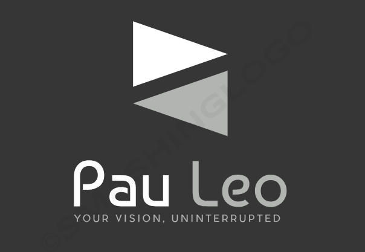

<div align="center">
  
</div>

# Paul Leonard's Video Hosting Platform

Welcome to Paul Leonard's Video Hosting Platform – a bespoke solution designed to provide a seamless, branded video experience. This platform allows Paul Leonard to upload, manage, and share videos exclusively under his brand, ensuring high-quality, uninterrupted viewing for his audience.

## Table of Contents

- [Features](#features)
- [Technology Stack](#technology-stack)
- [Setup and Installation](#setup-and-installation)
- [Usage](#usage)
- [Environment Variables](#environment-variables)
- [Contributing](#contributing)
- [License](#license)
- [Contact](#contact)

## Features

- **Customized Branding:** Maintain brand integrity with a fully branded video platform.
- **Video Management:** Upload and manage video content effortlessly.
- **Secure Streaming:** Ensure your videos are secure and accessible only to your audience.
- **User Engagement:** Engage viewers with comments and likes.
- **Analytics:** Track video performance and user engagement.
- **Shortened URLs:** Share videos easily with custom short URLs.

## Technology Stack

- **Backend:** Node.js, Express.js
- **Database:** MySQL, Sequelize ORM
- **Frontend:** HTML, CSS, JavaScript, EJS
- **Authentication:** Passport.js
- **Storage:** AWS S3 for video storage
- **Deployment:** AWS EC2 or similar hosting service

## Setup and Installation

### Prerequisites

- Node.js
- MySQL
- AWS account with S3 setup
- Git

### Installation

1. **Clone the Repository**
   ```bash
   git clone https://github.com/username/video-hosting-platform.git
   cd video-hosting-platform
   ```

2. **Install Dependencies**
   ```bash
   npm install
   ```
   
3. **Configure Database**
   Create a MySQL database and update the config/config.json file with your database credentials.

4. **Run Migrations**
   ```bash
   npx sequelize-cli db:migrate
   ```
   
5. **Set Up Environment Variables**
    ```bash
    AWS_ACCESS_KEY_ID=your_aws_access_key_id
    AWS_SECRET_ACCESS_KEY=your_aws_secret_access_key
    AWS_REGION=your_aws_region
    AWS_BUCKET_NAME=your_s3_bucket_name
    SESSION_SECRET=your_session_secret
   ```

6. **Start the Server**
   ```bash
   npm start
   ```

## Usage

1. **Admin Login**
  Navigate to http://localhost:3000/login to access the admin login page. Use the credentials provided during user setup.

2. **Upload Videos**
  Once logged in, use the admin dashboard to upload new videos, manage existing videos, and track video performance.

3. **View and Share Videos**
  Videos can be viewed at http://localhost:3000/video/:video_id and shared using shortened URLs generated via the dashboard.


## Environment Variables
  `AWS_ACCESS_KEY_ID`: Your AWS access key ID
  `AWS_SECRET_ACCESS_KEY`: Your AWS secret access key
  `AWS_REGION`: The AWS region where your S3 bucket is located
  `AWS_BUCKET_NAME`: The name of your S3 bucket
  `SESSION_SECRET`: A secret key for session management


## Contributing
  Contributions are welcome! Please follow these steps:
  
  1. Fork the repository.
  2. Create a new branch (git checkout -b feature/your-feature).
  3. Commit your changes (git commit -m 'Add your feature').
  4. Push to the branch (git push origin feature/your-feature).
  5. Open a pull request.


## License
This project is licensed under the MIT License. See the LICENSE file for details.


## Contact
For any inquiries or issues, please get in touch with admin at johnkponyo@hotmail.com

Thank you for using Paul Leonard's Video Hosting Platform! Your vision, uninterrupted.


  
